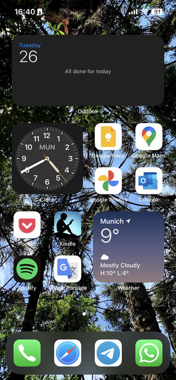

# Recommended iOS Settings

  
:warning: (Optional) Reset all settings (holding iCloud and e-mail accounts)

  Settings > General > Transfer or Reset iPhone > Reset > Reset All Settings.

## iPad Recommended Settings

Settings > General > Use Switch To: > Lock Rotation.

## iPhone Recommended Settings

Settings > Battery > Enable "Battery Percentage".

## iPad and iPhone Recommendded Settings

Settings > Apple ID > Find My > Find My iPhone > Enable "Send Last Location".

 

Settings > Mobile Data (Cellular) >

- (Optional) Mobile Data Options (Cellular Data Options) > Data Mode > Enable "Low Data Mode".
- Disable "Wi-Fi Assist", "iCloud Drive" and "iCloud Backup".

 

Settings > Sounds & Haptics > Keyboard Feedback > Enable "Haptic".

 

Settings > Focus >

- Do Not Disturb/Work > People > Allow Calls From: "Everyone".
- Sleep > People > Allow Calls From: "Contacts Only" and Enable "Allow Repeated Calls".

 

Settings > General > Keyboard >

- Keyboards > Add New Keyboard… > "Portuguese (Brazil)", "German (Germany)", "English (US)", "Emoji".
- Emoji > Disable "Stickers".

 

Settings > Control Center > Add "Low Power Mode", "Dark Mode" and "Screen Recording".

 

Settings > Display & Brightness >

- (Optional) Appearance > Dark.
- Night Shift > Scheduled > From 22:00 To 07:00.

 

Settings > Home Screen & App Library > Search > Disable "Show on Home Screen".

 

Settings > StandBy > Disable "StandBy".

 

Settings > Face ID & Passcode (Touch ID & Passcode)

- Stolen Device Protection > Turn On Protection.
- Enable "Erase Data".

 

Settings > Privacy & Security >

- Location Services > System Services > Product Improvement > Disable "iPhone Analytics", "Routing & Traffic" and "Improve Maps".
- Tracking > Disable "Allow Apps to Request to Track".
- Analytics & Improvements > Disable "Share iPhone Analytics", "Share iCloud Analytics", "Improve Safety", "Improve Siri & Dictation" and "Improve AR Location Accuracy".
- Apple Advertising > Disable "Personalized Ads".

 

Settings > App Store >

- Automatic Downloads > Disable "App Downloads".
- Video Autoplay > Off.
- Disable "In-App Ratings & Reviews".

 

Settings > Passwords > Password Options > Verification Codes > Enable "Clean Up Automatically".

 

Settings > Mail > Composing > Signature > Remove "Sent from my iPhone".

 

Settings > Contacts >

- Sort Order > First, Last.
- My Info.

 

Settings > Calendar > Default Alert Times > Birthdays > On day of event (09:00).

 

Settings > Phone > Calls > Wi-Fi Calling > Enable "Wi-Fi Calling on this iPhone".

 

Settings > Safari > Advanced > Advanced Tracking and Fingerprinting Protection > All Browsing.

 

Settings > Photos >

- Disable "iCloud Photos" and "Shared Albums".
- Transfer to Mac or PC > Keep Originals.

 

Settings > Camera > Composition > Enable "Grid".

 

Settings > Game Center > Disable "Game Center".

## iPhone Home Screen

Add a calendar widget (e.g. Apple Calendar, Google Calendar, Microsoft Outlook).
